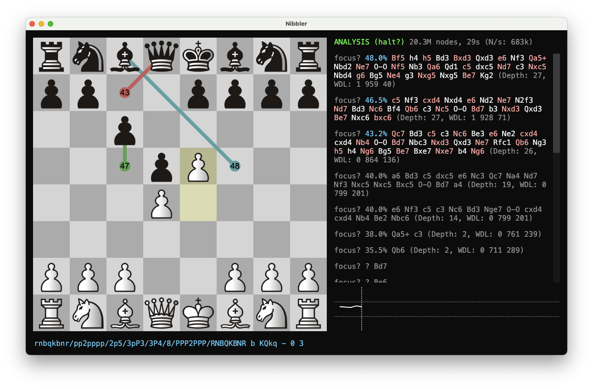

# Nibbler for macOS

This script installs the lastest release on your Mac, with a single command:

```bash
curl -s https://raw.githubusercontent.com/darkBuddha/nibbler-macos/main/install_nibbler_macos.sh | bash
```



## Features

* builds directly from [official repository](https://github.com/rooklift/nibbler)
* automatically detects/installs/configures [Stockfish](https://stockfishchess.org/) and [Leela Chess Zero](https://lczero.org/) (Lc0)
* works on Apple Silicon and Intel
* adds Nibbler version to `package.json`, so the "about" window shows the correct version instead of `1.0.0`, makes it easier to see if you are running the latest version
* HQ icon from Nibbler project
* keeps old installation if it exists, so you can easily switch back to it if needed
* cleans up after itself, so you don't have to worry about old files or dependencies

## Requirements

Everything is installed automatically, if needed ([Homebrew](https://brew.sh/)).

* [Git](https://git-scm.com/)
* [Node.js](https://nodejs.org/)
* [NPM](https://www.npmjs.com/)
* [librsvg](https://wiki.gnome.org/Projects/LibRsvg)
